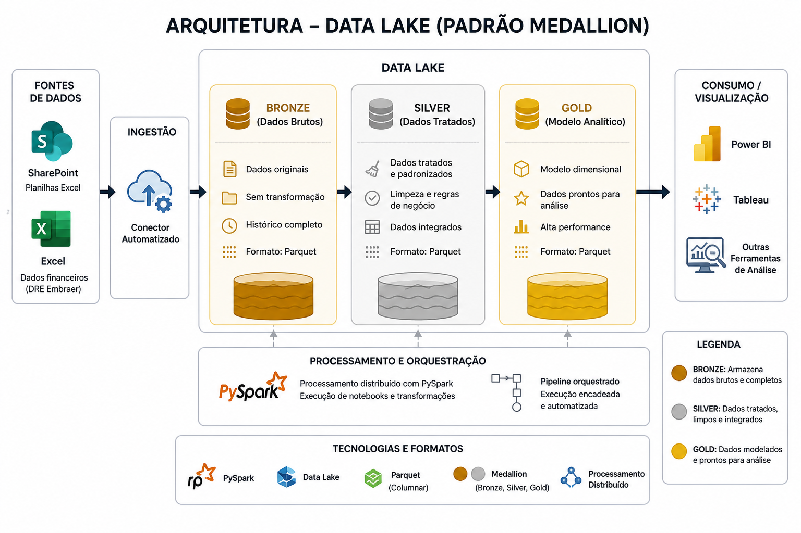

# 📊 DRE Embraer | Data Lake + PySpark (Arquitetura Medallion)

## 🧠 Sobre o Projeto

Desenvolvi um projeto para análise da DRE (Demonstração do Resultado do Exercício) da Embraer utilizando uma arquitetura em nuvem baseada em Data Lake.

O desafio: transformar dados públicos (Excel no SharePoint) em informação confiável para análise financeira, com foco em escalabilidade, governança e automação.

Este projeto demonstra a evolução de uma solução de BI baseada em arquivos para uma arquitetura moderna de dados, utilizando processamento distribuído com PySpark e organização em camadas (Bronze, Silver e Gold).

---

## 🚧 Contexto

Os dados estavam disponíveis em formatos semi-estruturados (Excel), o que dificultava:

* Padronização das análises  
* Reutilização dos dados  
* Escalabilidade da solução  
* Governança e rastreabilidade  

Inicialmente, desenvolvi uma versão em Power BI consumindo diretamente esses arquivos.

Essa abordagem permitiu uma implementação rápida, porém apresentava limitações importantes:

* Dependência de arquivos locais  
* Risco de quebra do relatório  
* Processamento repetitivo no Power BI  
* Baixa governança de dados  

Como evolução, construí uma solução baseada em SQL Server, trazendo maior centralização e controle.

Ainda assim, alguns desafios permaneceram:

* Limitação de escalabilidade em ambiente local  
* Dependência de infraestrutura gerenciada manualmente  
* Dificuldade de expansão para novos volumes e fontes  
* Baixa flexibilidade para processamento distribuído  

Mesmo com ganhos significativos em organização e performance, a solução ainda não estava preparada para cenários de grande volume de dados e arquiteturas modernas.

Diante disso, surgiu a necessidade de evoluir para uma arquitetura mais escalável, desacoplada e preparada para processamento distribuído.

---

## 🔗 Projetos anteriores

Power BI 👉 [*DRE Automatizada – Análise Financeira*](https://github.com/rsdiniz-data/dre-analise-financeira-powerbi)  

SQL Server 👉 [*DRE Embraer – SQL Server + Power BI*](https://github.com/rsdiniz-data/dre-data-pipeline-sql-server)

---

## 🚀 Evolução da Solução

Evoluí o projeto para uma arquitetura baseada em Data Lake, utilizando o padrão Medallion (Bronze, Silver e Gold) na plataforma da Nekt:

* Ingestão automatizada via SharePoint  
* Armazenamento em Data Lake  
* Transformações com PySpark (processamento distribuído)  
* Pipeline orquestrado e automatizado  
* Publicação de dados prontos para consumo analítico  

Com essa abordagem:

* Separação clara entre dado bruto, tratado e analítico  
* Processamento distribuído e escalável  
* Redução de acoplamento entre ingestão e consumo  
* Reuso de dados em múltiplos cenários  
* Maior governança e rastreabilidade  

Mais do que uma evolução técnica, foi a transição de um ambiente local para uma arquitetura orientada a dados em escala.

---

## 📌 Navegação

* 📄 [Justificativa](./docs/01_justificativa.md)
* 🏗️ [Arquitetura](./docs/02_arquitetura.md)
* ⚙️ [Desenvolvimento](./docs/03_desenvolvimento.md)
* 📊 [Dicionário de Dados](./docs/04_dicionario_dados.md)
* 💡 [Entrega de Valor](./docs/05_entrega_valor.md)

---

## 📄 Artigo Técnico

Este projeto também possui um material detalhado com regras de negócio, lógica do pipeline e decisões técnicas.

📘 [Acessar artigo completo no LinkedIn](link)    
📄 [Versão resumida no repositório](./docs/06_artigo_tecnico.md)

---

## 📊 Arquitetura

* Data Lake no padrão Medallion  
* Camada Bronze (dados brutos)  
* Camada Silver (dados tratados e padronizados)  
* Camada Gold (modelo analítico/dimensional)  
* PySpark para processamento distribuído  
* Dados armazenados em formato columnar (Parquet)  

📷 

---

## 🔄 Pipeline

SharePoint → Bronze → Silver (PySpark) → Gold (Dimensional) → Ferramentas de visualização

* Ingestão automática via conector  
* Execução encadeada de notebooks  
* Dependência entre camadas  
* Pipeline orientado a eventos  

---

## 💻 Scripts

* 🪵 [Camada Bronze (Ingestão)](./docs/03_desenvolvimento.md)  
* 📥 [Plano de Contas (Silver)](./scripts/cloud/silver/01_plano_conta.py)  
* 📊 [Resultado (Silver)](./scripts/cloud/silver/02_resultado.py)  
* 🧱 [Dimensão dPlanoConta (Gold)](./scripts/cloud/gold/03_d_plano_conta.py)  
* 🔄 [Fato ftResultado (Gold)](./scripts/cloud/gold/04_ft_resultado.py)  

---

## 💡 Valor para o Negócio

* Centralização da ingestão de dados  
* Redução de dependência de arquivos e ambientes locais  
* Maior confiabilidade e consistência dos dados  
* Escalabilidade para novos volumes e fontes  
* Base preparada para múltiplos consumidores (BI e dados)  
* Uso eficiente de recursos em nuvem com processamento distribuído  

---

## 📊 Consumo

Os dados da camada Gold podem ser consumidos por diferentes ferramentas de visualização e análise, como Power BI, Tableau ou outras soluções analíticas.

---

## 📢 Links

📊 [Acessar dashboard interativo](https://app.powerbi.com/view?r=eyJrIjoiOTcwN2E4OTMtNGUxMS00MDBjLTg3MjMtNzQzOWM0OWE0Y2I0IiwidCI6IjE2YjQyY2M1LTJiZWUtNDRjZS05MWE4LWYyMjgwMGRkZmZmYyJ9)  

---

## 🧠 Tecnologias Utilizadas

* PySpark  
* Data Lake  
* Parquet (formato columnar)  
* Arquitetura Medallion (Bronze, Silver, Gold)  
* SharePoint (origem dos dados)  
* Ferramentas de visualização (Power BI, entre outras)  

---

## ✅ Conclusão

O projeto evoluiu de:

➡️ Arquivos locais  
➡️ SQL Server (processamento centralizado)  
➡️ Data Lake com PySpark (processamento distribuído)  

Resultando em uma arquitetura moderna, escalável e alinhada com práticas de Engenharia de Dados.

Mais do que uma melhoria técnica, representa a transição para um modelo preparado para crescimento, governança e novos cenários analíticos.
