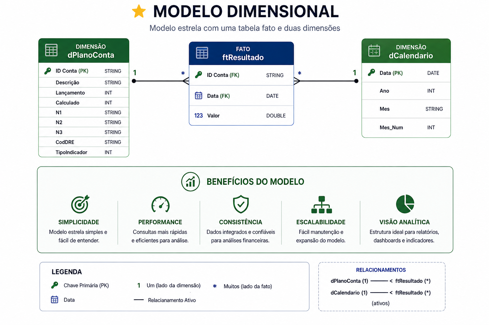

# 2. Arquitetura da Solução

## 🎯 Objetivo

Criar uma arquitetura escalável, organizada e rastreável, separando responsabilidades entre ingestão, tratamento e consumo analítico.

---

## 🧱 Camadas

### 🪵 Bronze (Raw Data)

* Dados brutos provenientes do SharePoint
* Sem transformação relevante
* Origem controlada e rastreável

Tabelas:

* `sharepoint_dfp_basepdf`
* `sharepoint_planocontas_planocontas`

---

### 🥈 Silver (Trusted Data)

* Dados tratados e padronizados
* Aplicação de regras técnicas
* Estruturação para análise

Artefatos:

* `PlanoConta` (parquet)
* `Resultado` (parquet particionado por ano)

---

### 🥇 Gold (Business Data)

* Dados prontos para consumo analítico
* Modelagem dimensional (Star Schema)

Tabelas:

* `dPlanoConta`
* `ftResultado`

---

## ⭐ Modelo Dimensional

* Fato: `ftResultado`
* Dimensão: `dPlanoConta`    
* Dimensão: `dCalendario`

Relacionamento:

`dPlanoConta (1) → (N) ftResultado`
`dCalendario (1) → (N) ftResultado`

📷 

---

## 🔄 Pipeline

SharePoint → Bronze → Silver → Gold → Power BI

---

## 🔗 Rastreabilidade

* 🪵 Bronze (Ingestão via SharePoint): [Ver documentação](../docs/03_desenvolvimento.md)

* 🥈 Transformação PlanoConta:
  👉 [01_plano_conta.py](../scripts/cloud/silver/01_plano_conta.py)

* 🥈 Transformação Resultado:
  👉 [02_resultado.py](../scripts/cloud/silver/02_resultado.py)

* 🥇 Publicação dPlanoConta:
  👉 [03_d_plano_conta.py](../scripts/cloud/gold/03_d_plano_conta.py)

* 🥇 Publicação ftResultado:
  👉 [04_ft_resultado.py](../scripts/cloud/gold/04_ft_resultado.py)
